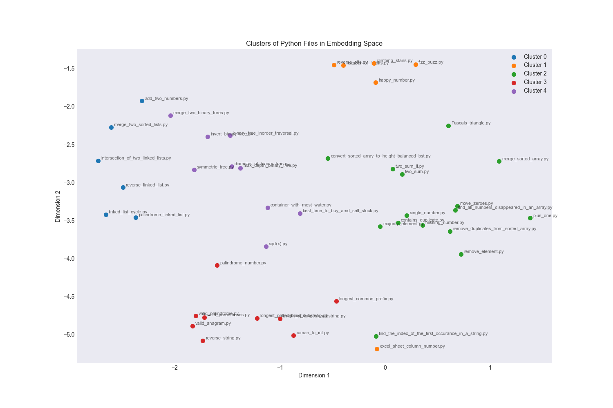
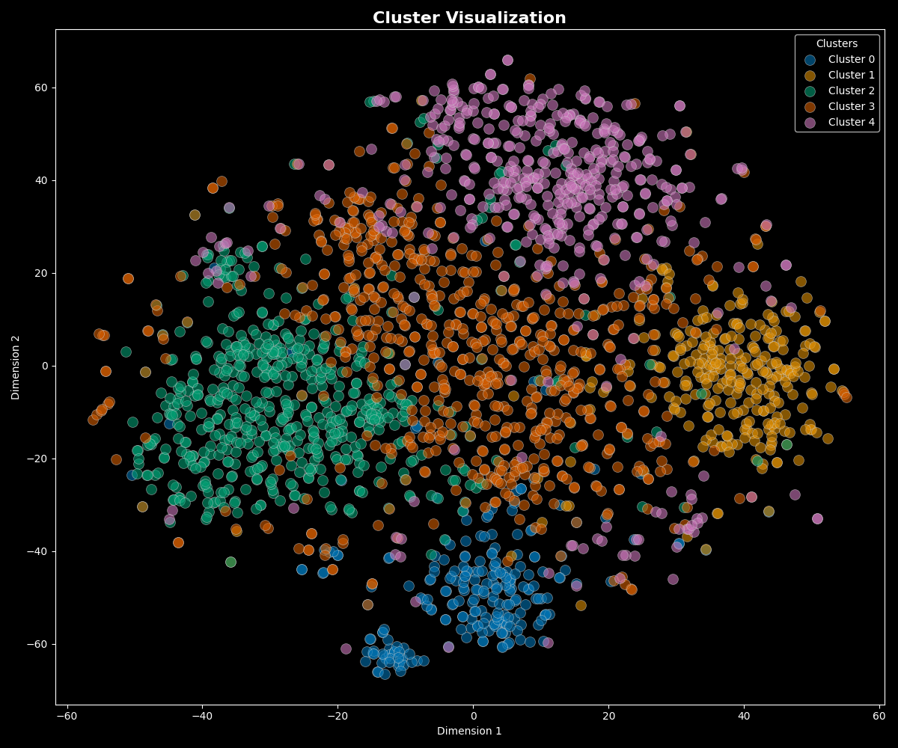

# LeetCode Analysis 📊

This repository contains scripts for performing data analysis on LeetCode questions. The main idea is to compare the questions I've solved with all the questions available on LeetCode. This analysis can provide insights into the types of problems I've been focusing on, and how they compare to the overall distribution of problems on LeetCode.

<table>
  <tr>
    <td></td>
    <td></td>
  </tr>
</table>

## Why Use This Repo? 🚀

If you're a LeetCode user looking to understand your problem-solving patterns and areas of focus, this repo is for you! It provides a structured way to analyze your LeetCode activity and compare it with the overall problem distribution on the platform. This can help you identify areas where you might need more practice or diversification.

## Repo Structure 🏗️

```bash
.
├── .gitignore
├── requirements.txt
└── scripts
    ├── cluster_plot.py
    └── code_to_embeddings.py
└── solutions
    ├── add_two_numbers.py
    ├── binary_tree_inorder_traversal.py
    ...
```

## Usage 🎯

First, install the required Python packages:

```bash
pip install -r requirements.txt
```

Then, run the `code_to_embeddings.py` script to extract embeddings from your solutions and the HuggingFace LeetCode solutions dataset:

```bash
python scripts/code_to_embeddings.py
```

Finally, run the `cluster_plot.py` script to perform clustering on the embeddings and visualize the clusters:

```bash
python scripts/cluster_plot.py
```

## Example 📝

Here's an example of how to use the `process_embeddings` function in `cluster_plot.py`:

```python
process_embeddings("data/embeddings.pkl", figname="cluster_plot")
```

This will load embeddings from `data/embeddings.pkl`, perform KMeans clustering, reduce dimensionality using t-SNE, and plot the clusters to `data/cluster_plot.png`.

## Conclusion 🎈

This repo provides a powerful tool for analyzing your LeetCode problem-solving patterns. By comparing your activity with the overall problem distribution on LeetCode, you can gain valuable insights and guide your future problem-solving efforts. Happy coding! 🎉